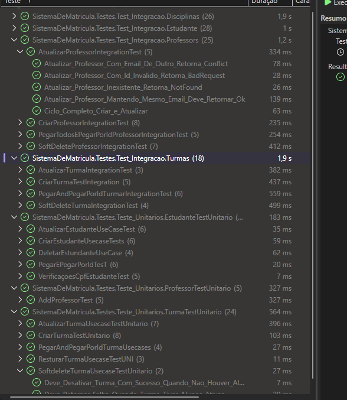

🎓 Sistema Básico de Escola
Este é um projeto de back-end robusto desenvolvido em C# e .NET, focado na gestão escolar. O sistema foi construído aplicando os princípios mais modernos de engenharia de software para garantir escalabilidade e manutenibilidade através de um desenvolvimento orientado a testes (TDD).

🚀 Status do Projeto: Fase de Refinamento
O núcleo de gestão de Turmas, Professores, Estudantes e Disciplinas está 100% implementado e validado.

Foco Atual: Implementação do módulo de Matrícula (lógica de associação e regras de negócio complexas).

Próxima etapa: Expansão da cobertura para testes de integração de ponta a ponta.

🛠️ Tecnologias e Práticas Utilizadas
Linguagem & Framework: C# e .NET (Ecossistema fundamental).

Arquitetura: Clean Architecture / Domain-Driven Design (DDD).

Qualidade de Código (TDD):

xUnit: Framework de testes principal.

Moq: Isolamento de dependências através de Mocks.

Bogus: Geração de dados de massa realistas para testes consistentes.

FluentAssertions: Asserções legíveis e expressivas.

Persistência: Entity Framework Core com suporte a Soft Delete e IgnoreQueryFilters para restauração de dados.

✅ Evidência de Qualidade
Abaixo, a execução da suíte de testes validando 153 cenários, incluindo fluxos de sucesso, exceções de negócio, validações de Value Objects (VOs) e integridade referencial.

Nota: A cobertura inclui testes unitários e de integração, garantindo que as regras de negócio e a persistência em banco de dados estejam em harmonia.

🏗️ Destaques da Implementação
Validação de Conflitos: Lógica integrada nos Use Cases para impedir duplicidade de códigos de turma ou CPFs duplicados.

Segurança de Estado: Travas de segurança que impedem a desativação de entidades (como turmas ou professores) que possuam vínculos ativos no sistema.

Terminologia Profissional: Priorização de termos em Inglês para commits e documentação técnica, seguindo padrões internacionais.

📈 Road Map
[x] CRUDs e Domínio de Professores, Disciplinas e Estudantes.

[x] Implementação de Use Cases e VOs para o módulo de Turma.

[x] Cobertura de 150+ Testes (Unitários e Integração).

[ ] Finalização do Módulo de Matrícula (Em progresso).

[ ] Configuração de CI/CD via GitHub Actions.

Desenvolvido por Zander Gustavo (gustavo-limaa)

